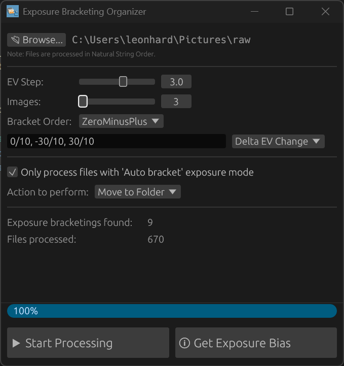

# ExposureBracketingOrganizer

ExposureBracketingOrganizer is a GUI application designed to streamline the process of organizing bracketed exposures. It automatically detects sequences of images taken with varying exposure values (EVs) and moves them into nested folder. This organization makes it significantly easier to process these bracketed sets with other software like [HDRMerge](https://jcelaya.github.io/hdrmerge/).

## Motivation

There is no consistent, standardized way across camera manufacturers to identify exposure-bracketed image sets. While some cameras include MakerNote tags, others offer no bracket-specific metadata. Many existing tools rely solely on time gaps between shots to detect bracketed sets. This method is error-prone, especially in mixed shooting conditions or fast-paced sessions where non-bracketed and bracketed bursts may overlap.

ExposureBracketingOrganizer solves this by moving beyond unreliable temporal analysis, using EXIF tag [0x9204 ExposureBiasValue](https://www.media.mit.edu/pia/Research/deepview/exif.html) to accurately identify true exposure-bracketed sequences.

## Usage

You have to recreate the Exposure bracketing settings of your camera. If you don't know it, you can just discover them using the "Get Exposure Bias" Button.

## File Ordering

The application processes files using "[Natural String Ordering](https://crates.io/crates/natord)" (e.g., `A6401473.ARW`, `A6401474.ARW`, ..., `A6401480.ARW`). This ensures that sequences are detected correctly.

Default camera filenames usually follow this ordering naming schema. However, **when a custom file name is used**, the ordering might not work as expected, leading to issues in sequence detection.

## Under the Hood

ExposureBracketingOrganizer leverages the excellent [`rawler`](https://crates.io/crates/rawler) library by `dnglab` for robust RAW file parsing capabilities.
